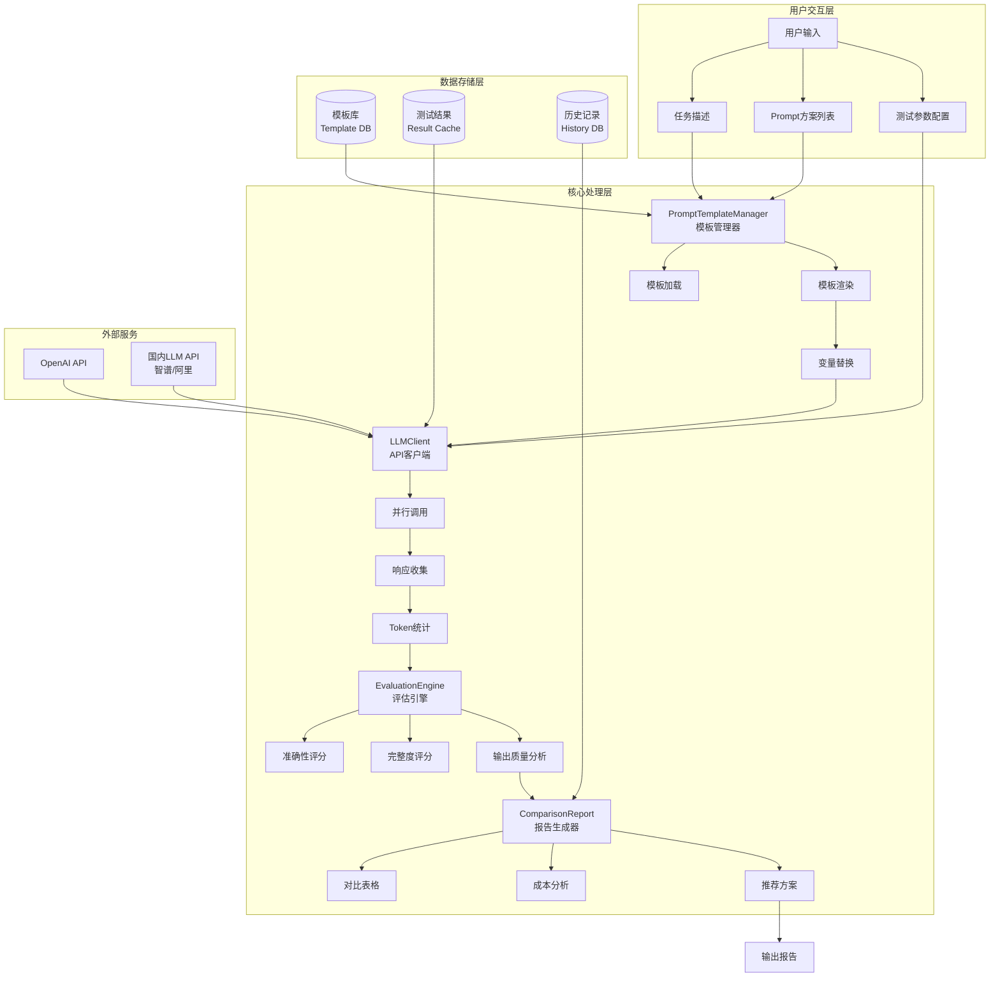
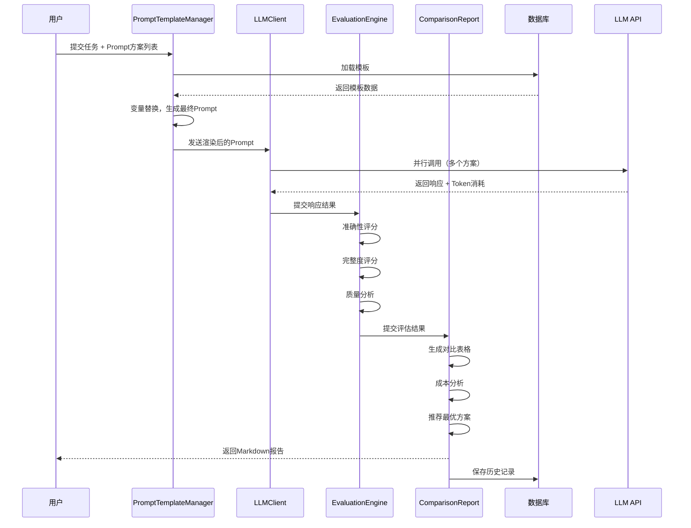
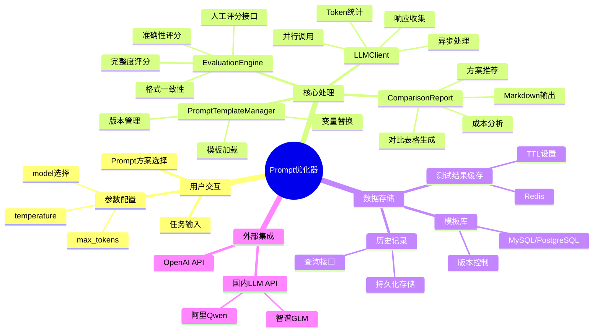

# Prompt优化器架构图

> 生成时间：2026-04-30
> 用途：Week 2 Day 7 实战项目设计

---

## 一、系统架构图



---

## 二、核心组件交互时序图



---

## 三、模块职责脑图



---

## 四、技术选型表

| 层级 | 组件 | 技术选型 | 原因 |
|------|------|----------|------|
| **Web层** | REST API | Spring Boot | Java后端标准 |
| **异步处理** | 并行调用 | CompletableFuture | 原生支持、易控制 |
| **LLM SDK** | API调用 | OpenAI Java SDK | 官方支持、类型安全 |
| **缓存** | 结果缓存 | Redis | 快、支持TTL |
| **存储** | 模板库 | MySQL/PostgreSQL | 成熟、查询方便 |
| **报告输出** | Markdown | CommonMark | Java Markdown库 |

---

## 五、核心接口设计

```java
// PromptTemplateManager 接口
public interface PromptTemplateManager {
    PromptTemplate loadTemplate(String templateId);
    String renderTemplate(String templateId, Map<String, String> variables);
    void registerTemplate(PromptTemplate template);
    List<PromptTemplate> listTemplates(String category);
}

// LLMClient 接口
public interface LLMClient {
    List<LLMResponse> batchCall(List<String> prompts, LLMConfig config);
    CompletableFuture<LLMResponse> asyncCall(String prompt, LLMConfig config);
    TokenUsage calculateTokens(String prompt);
}

// EvaluationEngine 接口
public interface EvaluationEngine {
    EvaluationResult evaluate(String response, String expectedOutput);
    List<EvaluationResult> batchEvaluate(List<String> responses, String expectedOutput);
    QualityScore analyzeQuality(String response);
}

// ComparisonReport 接口
public interface ComparisonReport {
    String generateMarkdown(List<EvaluationResult> results);
    CostAnalysis analyzeCost(List<TokenUsage> usages);
    Recommendation recommendBest(List<EvaluationResult> results);
}
```

---

## 六、数据流向总结

```
输入：任务描述 + Prompt方案列表 + 测试参数
  ↓
模板管理：加载模板 → 渲染（变量替换）→ 生成最终Prompt
  ↓
API调用：并行调用LLM → 收集响应 → 统计Token消耗
  ↓
效果评估：准确性评分 → 完整度评分 → 输出质量分析
  ↓
报告生成：对比表格 → 成本分析 → 推荐最优方案
  ↓
输出：Markdown格式报告（含对比、成本、推荐）
```

---

**更新记录**：
- 2026-04-30：初始版本（架构图设计）